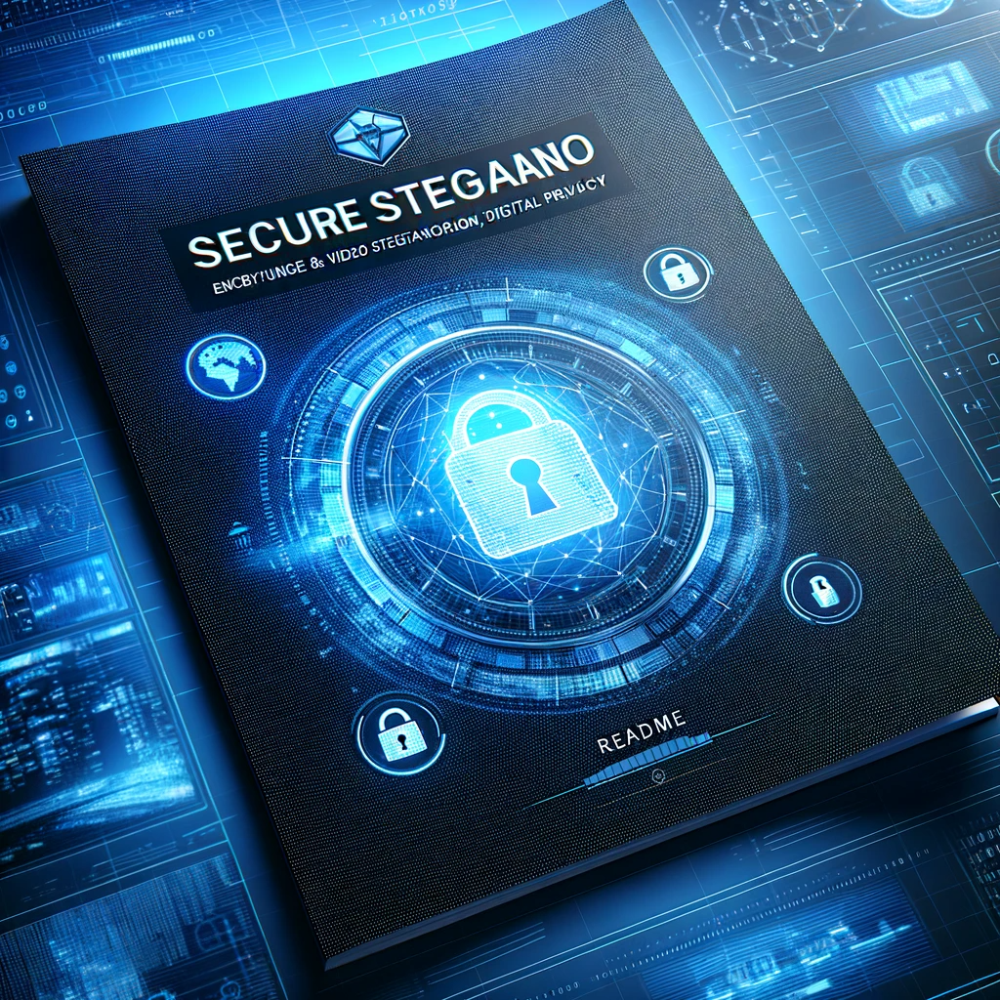

# Secure Stegano - 
### Embedding privacy in every frame!


## Table of Contents
1. [Introduction](#introduction)
2. [Objective](#objective)
3. [Features](#features)
4. [Installation](#installation)
   - [General Requirements](#general-requirements)
   - [Linux & WSL](#for-linux--wsl)
   - [Mac](#for-mac)
5. [Usage](#usage)
   - [Encoding](#encoding)
   - [Decoding](#decoding)
6. [Cracking Keys](#cracking-keys)
   - [About AES-256](#about-aes-256)
   - [AES-256 Security](#aes-256-security)
   - [About RSA-5000](#about-rsa-5000)
   - [RSA-5000 Security](#rsa-5000-security)


## Introduction
Secure Stegano is a cutting-edge tool designed for AES 256 and RSA encrypted video steganography. This advanced utility embeds encrypted data within videos, ensuring a high level of security and privacy.

## Objective
The primary objective of Secure Stegano is to provide a robust and secure method to encode and decode sensitive information within video files using AES-256 or RSA encryption techniques.

## Features
- **Encryption & Encoding:** Encrypt and encode text in videos using AES-256 or RSA encryption.
- **Decoding & Decryption:** Decode and decrypt text from videos.
- **Frame Number Encryption:** Encrypt frame numbers with AES or RSA.
- **Hidden Frame Numbers:** Store encrypted frame numbers inside another image (e.g., encrypt.png).
- **Security Assurance:** Extremely difficult to brute force due to the complexity of AES-256 and RSA-5000 encryption.

## Installation

<details>
<summary><b>For Linux</b></summary>
- Install FFmpeg: `sudo apt install ffmpeg -y`
- Clone the project: `git clone https://github.com/shriya-02coder/Secure-Stegano`
- Navigate to the directory and install requirements: `pip install -r requirements.txt`
- Create RSA keys: `python3 rsagen.py`
</details>>

<details>
<summary><b>For MacOS</b></summary>
- Install FFmpeg: `brew install ffmpeg`
- Clone the project: `git clone https://github.com/shriya-02coder/Secure-Stegano`
- Navigate to the directory and install requirements: `pip install -r requirements.txt`
- Create RSA keys: `python3 rsagen.py`
</details>>


## Usage
### Encoding
1. Run: 
 ```sh 
 python3 encode.py <video-to-encode-with-extension>

2. Choose your preferred encryption type from AES and RSA
3. If you choose AES then specify the key type from HEX(eg:1234567890ABCDEF1234567890ABCDEF1234567890ABCDEF1234567890ABCDEF) and ASCII (eg: 3)
and then specify the path to the public key. For RSA, no such specification will be required.
4. Enter 15 different frame numbers (for eg: 11 12 31 45 5 68 72 83 9 110 131 122 23 14 19) wherein you want to encode the data.

### Decoding
1. Run: 
 ```sh 
 python3 decode.py <video-to-decode-with-extension>
 
2. If AES encryption is used, name the image where the encrypted frame numbers are stored (default: encrypt.png). 
3. Provide the AES key, which will be stored in the AES-encryption-key file.
4. If RSA is used, the 'keys' folder will be directly accessed to retrieve the keys.

## Cracking Keys
### About AES-256:
AES-256 (Advanced Encryption Standard) is a symmetric key encryption cipher, and it's one of the most secure encryption methods available. It's widely recognized and used by governments and organizations globally for classified communication. The 256-bit key size means there are 2^256 possible combinations, making brute force attacks virtually impractical.

### AES-256 Security:
- **Robustness:** Considered virtually unbreakable with current computing capabilities. The sheer number of possible keys makes brute force attacks futile.
- **Global Standard:** Endorsed and used by various governments and industries for securing sensitive data.

### About RSA-5000:
RSA (Rivest-Shamir-Adleman) is an asymmetric encryption algorithm that utilizes two keys — one public and one private. The number 5000 refers to the key size, indicating a very high level of complexity and security. RSA is widely used for secure data transmission.

### RSA-5000 Security:
- **Exponential Security:** The security of RSA increases exponentially with key size. RSA-5000 offers an astronomical number of possible combinations, far beyond the reach of current and foreseeable computational power.
- **Infeasible Decryption:** Without the private key, decrypting the data is practically impossible. Even with significant advancements in computing technology, breaking RSA-5000 remains a theoretical rather than a practical possibility.


